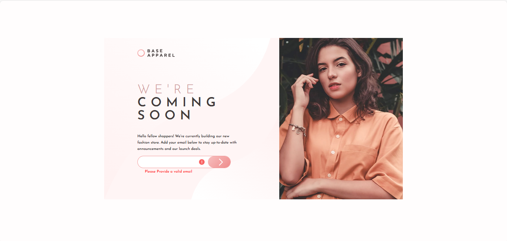

# Frontend Mentor - Base Apparel coming soon page

This is a solution to the [Base Apparel coming soon page
](https://www.frontendmentor.io/challenges/base-apparel-coming-soon-page-5d46b47f8db8a7063f9331a0). Frontend Mentor challenges help you improve your coding skills by building realistic projects.

## Table of contents

- [Overview](#overview)
  - [The challenge](#the-challenge)
  - [Screenshot](#screenshot)
  - [Links](#links)
  - [Installation](#Installation)
  - [Usage](#Usage)
- [My process](#my-process)
  - [Built with](#built-with)
  - [What I learned](#what-i-learned)
  - [Continued development](#continued-development)
- [Author](#author)
- [Acknowledgments](#Acknowledgments)

## Overview

### The challenge

This layout looks simple enough, but there are some interesting details to it that will test your CSS skills. You'll also get to practice basic form validation.

Your users should be able to:

- Receive an error message when the form is submitted if:
  - The input field is empty
  - The email address is not formatted correctly

### Screenshot



### Links

- Solution URL: [here](https://github.com/olahasan/HTML_CSS_AND_JS_Frontend-Mentor-NEWBIE-Base-Apparel-coming-soon-page/tree/main)

- Live Site URL: [here](https://olahasan.github.io/HTML_CSS_AND_JS_Frontend-Mentor-NEWBIE-Base-Apparel-coming-soon-page/)

## Installation

To get a local copy up and running, follow these simple steps:

1. **Clone the repository**:

   ```sh
   git clone https://github.com/your-username/your-repo-name.git
   ```

2. **Navigate to the project directory**:

   ```sh
   cd your-repo-name
   ```

3. **Open the project in your preferred code editor**.

## Usage

To use the components in your project, you can simply copy the HTML, CSS, and JavaScript files into your project directory. Make sure to link the CSS and JS files correctly in your HTML.

## My process

### Built with

- Semantic HTML5 markup
- CSS custom properties
- Flexbox
- JavaScript for form validation

### What I Learned

In this project, I practiced using Flexbox for layout and CSS custom properties for better maintainability. I also focused on practiceing basic form validation..

### Continued Development

I plan to continue improving my skills in html,css and javascript

### Author

Frontend Mentor - @olahasan<br>
GitHub - @olahasan

### Acknowledgments

I would like to thank the **Frontend Mentor** for providing this challenge and to the community for their support and feedback
